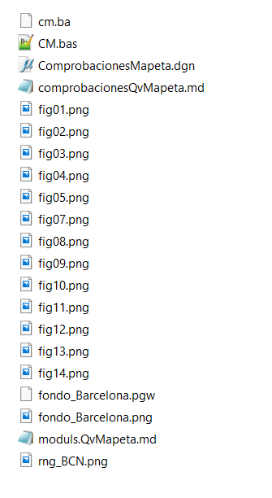

## Qué es qué...

### Documentación:
[Ir ](./moduls.QvMapeta.md)  a  moduls.QvMapeta.md  --> Doc verbosa de QvMapeta

[Ir ](./comprobacionesQvMapeta.md)  a   comprobacionesQvMapeta.md--> Cómo se conecta mapeta con mundo

---
### Ficheros auxiliares:
*fig*.png* --> imagenes para ilustrar MD's

*fondo_Barcelona.png*  --> para referenciar como raster al dgn y ver facilitar la comprensión de los calculos
*fondo_Barcelona.pgw*  --> datos georeferenciacion del png. Tamaño, rango...
*rng_BCN.png*  -->datos de rango del mapeta, 

---
### Ficheros para ejecucion de pruebas
*comprobacionesMapeta.dgn*  --> 

*CM.bas*  --> escrito por version de desarrollo de QvMapeta. Son los calculos que realiza el programa, transcritos de modo que se puedan representar en un DGN.

---
Ficheros del directorio:

