<!-- para comentarios
-->
[Ir ](./moduls.QvMapeta.md)  a  moduls.QvMapeta.md

#  comprobacion de calculos en QvMapeta

## Idea general
La clase QvMapeta realiza calculos geometricos dificiles de seguir sin una representación grafica. La versión de desarrollo QvMapeta_vba.py va escribiendo los resultados de los cálculos en el fichero CM.bas que microstation es capaz de ejecutar.

## Ubicación de ficheros
 - D:\qVista\Codi\guies\DocModuls\QvMapeta

## Ficheros de esa carpeta

### ComprobacionesMapeta.dgn

DGN donde se representaran los calculos.
Tiene referenciado como raster fondo_Barcelona.png, (2 veces) en: 
   - coordenadas 0,0   --> 600,600
   - coordenadas xmin,ymin  --> xmax, ymax

### fondo_Barcelona.pgn
png con la informacion raster de Barcelona
tamaño 600 x 600
corresponde al rango:
xmin,ymin:   xy= 419514.49,4573673.32
xmax,ymax: xy= 437653.75, 4591812.58

### fondo_Barcelona.pgw
Georeferenciación de fondo_Barcelona.pgn (World file)
[https://en.wikipedia.org/wiki/World_file](https://en.wikipedia.org/wiki/World_file)

### CM.bas
Fichero vba, escrito por QvMapeta_vba.py, que dibuja en el DGN los calculos.

## Ejecución

 - Ejecutar QvMapeta_vba.py
	 - Establecer rotacion
	 - Pulsar botón para comenzar a grabar operaciones.
	 - Realizar las opperaciones que se quieran comprobar.
	 - Pulsar botón para finalizar la grabación de operaciones.
	
- Entrar en el ComprobacionesMapeta.dgn
	- Ejecutar cm.bas, para ello:
		- Utilidades >> Macros >>  Microstation BASIC >> Examinar
		- Buscar D:\qVista\Codi\guies\DocModuls\QvMapeta\cm.bas
		- Ejecutar o editar (para poder ir paso a paso)

## Como trabaja
Situacion inicial:

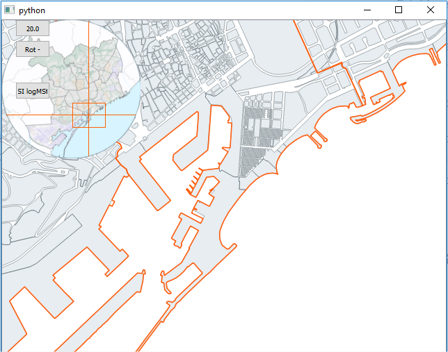

**He hecho una ventana**

Situacion final:

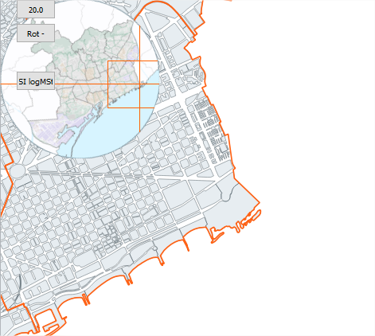

Miro en carpeta:
Si he operado correctamente con el botón SI logMst, se habrá generado el fichero D:\qVista\Codi\guies\DocModuls\QvMapeta\cm.bas

Entro en microstation

Abro D:\qVista\Codi\guies\DocModuls\QvMapeta\ComprobacionesMapeta.dgn

Busco cm.bas para ejecutarlo paso a paso

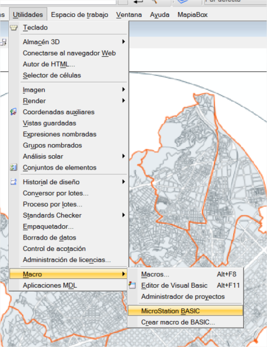

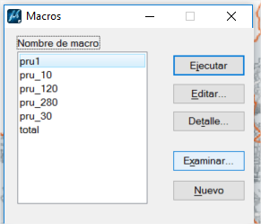

Ejecuto paso a paso:

D:\qVista\Codi\guies\DocModuls\QvMapeta\cm.bas

Opcion EDITAR y Ejecuto paso a paso:

**mouseReleaseEvent**

---
*ROJO MAPETA*

Dibujamos area a representar sobre el mapeta.

Es el area &quot;deseada&quot;, que se recalculará para que se vea totalmente en el canvas, de tal manera, que tras los calculos, veremos en el mapeta que se ha recalculado este area con las proporciones del canvas y que incluye esta area señalada inicialmente.

Las coordenadas de este area deseada se almacenan en:

self.xIn, self.yIn, self.xFi, self.yFi

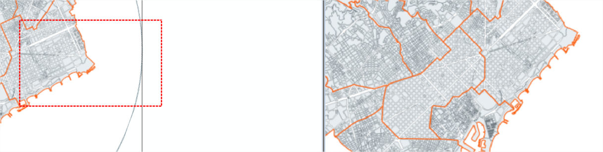

---
*MARRON MAPETA*

self.xIn, self.yIn,

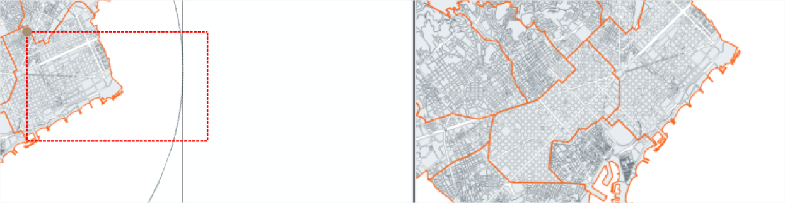

---
*VERDE MAPETA*

Punto inicio rotado hasta 0º

El punto arriba-izquierda del area &quot;deseada&quot;(punto marron) se desrota (punto verde) respecto al centro del propio mapeta para poder calcular las coordenadas mundo. Lo hacemos gracias a que el mapeta está georeferenciado. Conocemos el tamaño del mapeta y las coordenadas mundo de sus 4 esquinas

self.xIn\_ self.yIn\_

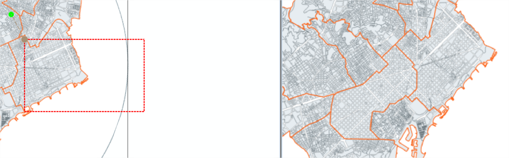

---
*VIOLETA MUNDO*

Punto rotado a mundo. Para ver la correspondencia dibujo linea negra discontinua.

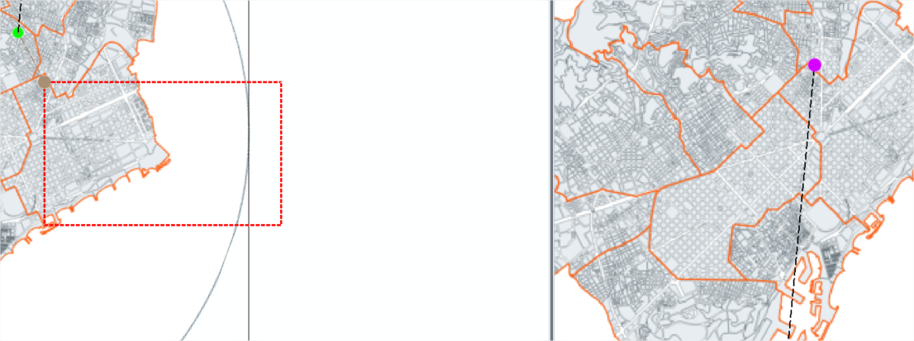

---
CAJA VIOLETA MUNDO

Desde punto rotado mundo construccion de caja,escalada, equivalente a la realizada en mapeta. Estará rotada.

Es el area mundo &quot;deseado&quot;

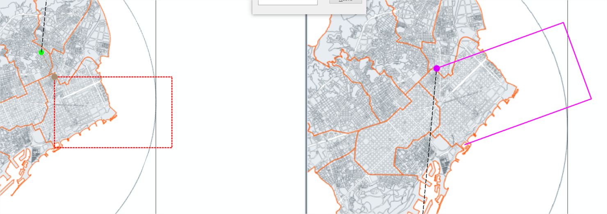

---
*AMARILLO y AZUL MUNDO*

Estos puntos sosn el rango del area mundo deseado

Se las pasamos al canvas via setExtend

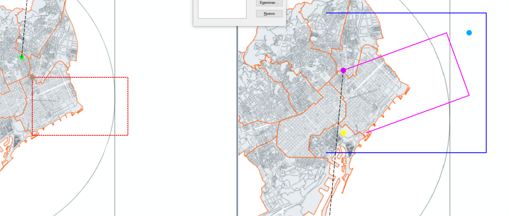

---
*CAJA AZUL MUNDO*

Qgis hace sus calculos en funcion de las proporciones del canvas y nos retorna su area &quot;respuesta&quot;

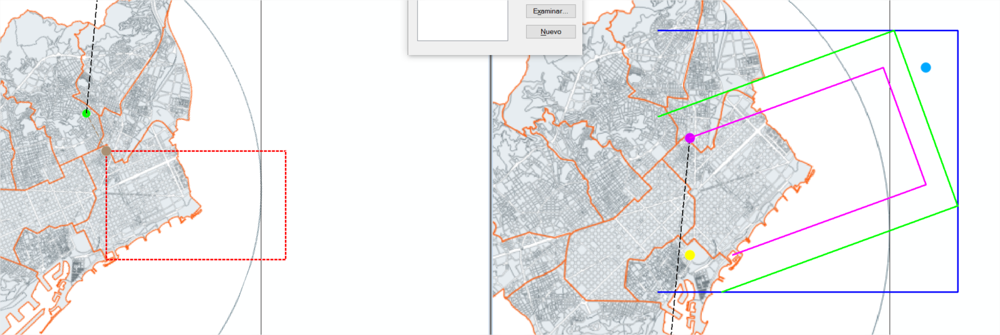

---
*CAJA VERDE MUNDO*

&quot;Expansión&quot; de la caja violeta de modo que la caja azul sea su rango. Es lo que se verá en el canvas.

---
*CAJA ROJA MAPETA*

Proceso marcha atras: Recalculamos un area mapeta de &quot;respuesta&quot; que refleja lo que se ve en el canvas.

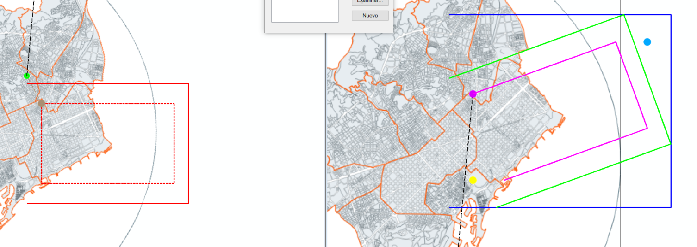

<!--stackedit_data:
eyJoaXN0b3J5IjpbLTQ1OTI5ODQ5MSw0MDg0NDI4NjYsLTE2Nz
c4NjI5NDgsMTM5NjczNjE1NywtMTgxNTcwNzU4NiwtMTcyMTE5
MDQyMSwtMTYzOTA4MDI4NywtODQ5MzQ2NDkxLDE3MjE2NDM1ND
ZdfQ==
-->
