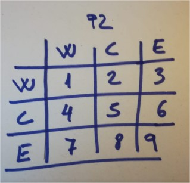

# Help on class QvMapeta in module moduls.QvMapeta:

class QvMapeta(PyQt5.QtWidgets.QFrame)
QvMapeta(canvas, ficheroMapeta, pare=None)
La classe que defineix el mapeta de posicionament i que controla un 
canvas.

## CalcularPNGyRangoMapeta(self, ficheroEnviado)
Hay 2 ficheros complementarios: PNG y PGW. (PNG la imagen, 
PGW su georeferenciacio,  en esta versión referida a un mapeta sin b
rotación). La funcion recibe un fichero (cualquiera de los dos) y 
busca su complementario. 
Con ambos calcula y la anchura y altura del PNG, y su rango.
    
 ## DetectoCuadrante(self)
Retorno el cuadrante en que está el angulo de rotacion
  4     1
  3     2
    
## PngPgwDroped(self, ficheroMapeta)
  Recibe un fichero soltado y lo manda a funcion para calcular el
  nombre del mapeta y su rango
    
## SegmentoDeRangoEnCirculo(self, P1, P2, centro, radio)
  Retorna l trozo d segmento incluido n un circulo y l caso pra control

    
##  SegmentoEnCirculo(self, P1, P2, centro, radio)
    Sig_dadoPNT = <unbound PYQT_SIGNAL Sig_dadoPNT(QPoint)>
    __init__(self, canvas, ficheroMapeta, pare=None)
  Inicialització del mapeta.
  
  Arguments:
      QFrame {[self]} -- [QvMapeta]
      canvas {[QgsMapCanvas]} -- [El canvas que gesrtionarà el mapeta.]
  
  Keyword Arguments:
      tamanyPetit {bool} -- [True pel Mapeta petit, False pel Mapeta
       gran] (default: {False})
      pare {[QWidget]} -- [El widget sobre el que es pintarà el mapeta.
       és obligatori.] (default: {None})
    
## cambiarMapeta(self)
- La imagen del mapeta 0º se gira lo que manda la rotación del canvas y se recarga en el mapeta
- Se invoca en la carga y cuando se detecta una rotacion
- 
    
## conversioPantallaMapa(self, punt)
Entran: coordenadas del mapeta
Salen: coordenadas mundo
    
## discrimimar_caso_H(self, P1, PW, PE)
Saber si P1 esta en zona West/Centro/ Est delimitadas por PW y PE
    
## discrimimar_caso_V(self, P1, PN, PS)
Saber si P1 esta en zona Norte/Centro/ Sur delimitadas por PN y PS
    
## distancia(self, p1, p2)
Dados 2 puntos reotrna su distancia
    
## distancia_(self, p1, p2)
Dados 2 puntos retorna su distancia
    
## enCirculo(self, pnt, radio, centroMapeta)
Detecta si un punto esta en el circulo inscrito en el mapeta
    
## enterEvent(self, event)
  enterEvent(self, QEvent)
    
## mouseMoveEvent(self, event)
- Presion de un boton del raton mantenia y movimiento sobre el mapeta
- **repaint de mapeta para forzar paintEvent**  (pintar rectangulo y cruz)
    
## mousePressEvent(self, event)- Presion de un boton del raton cuando el cursor está sobre el mapeta
- Guarda coordenadas de punto del mapeta en *self.begin y self.end*
- Comprueba si el punto dado está en el circulo inscrito del mapeta, y si no lo está emite esas coordenadas (serán para compass)
- Mantiene self.pPM (punto para mapeta) a True si lo ha de gestionar mapeta o a False si ha de utilzarlo Compass
  
## mouseReleaseEvent(self, event)
 - Dejamos de hacer presion sobre un boton del raton mientras está sobre mapeta
 - Calculo las coordenadas pantalla del centro del rectangulo de selección, o lo que es lo mismo del punto que señala la cruz y las transformo a coordenadas mundo.
 - Si el mapeta esta girado, hay que rotar esas coordenadas en función de la rotación para tenerlas en "mapeta 0º" y a partir de ahi buscar su correspondendientes coordfenadas mundo.
 - **canvas.setExtent() forzará pintarMapeta** 
 - **repaint de mapeta para forzar paintEvent** (pintar rectangulo y cruz)
    
## paintEvent(self, event)
- pinto en mapeta rectangulo y cruz.
- En esta version, con el mapeta circular, solo se dibuja los trozos de rectangulo y cruz interiores al circulo

## pintarMapeta(self)
- Se invoca cuando cambian el tamaño del canvas y cuando hay una   rotacion del canvas
  
-  Despues de seleccionar una ventana en el mapeta, se actualiza   la cartografia correspondiente  en el canvas, y se adapta alas proporciones del canvas (estado inicial y  redimensionamientos).
       
 >Estás proporciones serán diferentes a las de la ventana  del mapeta (nuestra seleccion) y por lo tanto debemos recalcular la ventana del mapeta representando sobre éste el area de cartografia visible y una cruz que indica el centro
  
Esta funcion calcula unas coordenadas para que trabaje el 
paintEvent (que es quien pinta la caja y la cruz...)
- **repaint de mapeta para forzar paintEvent** (pintar rectangulo y cruz)
    
    
## setDropable(self)
 Implementacion Drop ficheros png y pgw sobre el mapeta. 
 Mapeta será capaz de recibir PNG o PGW para recargar su imagen
   
